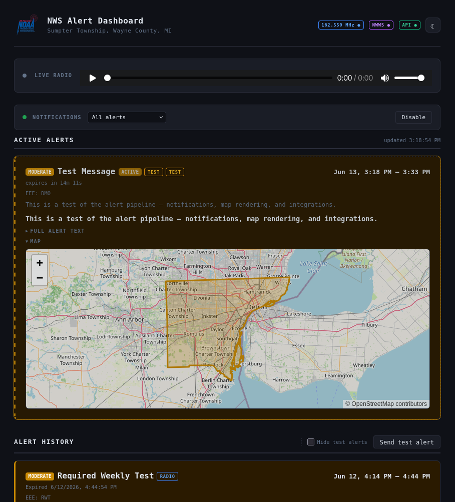
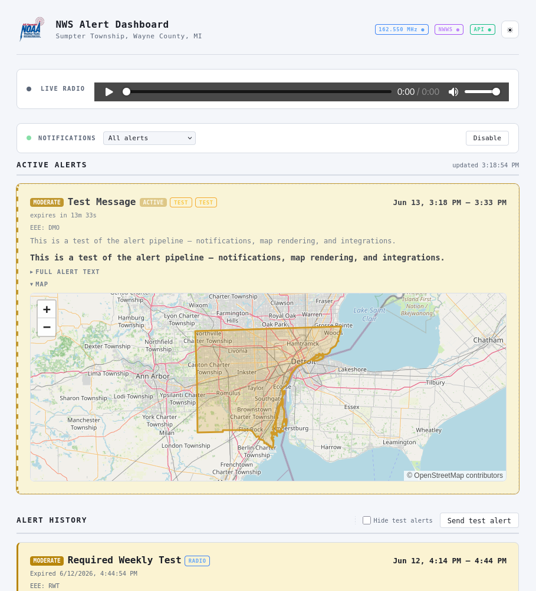
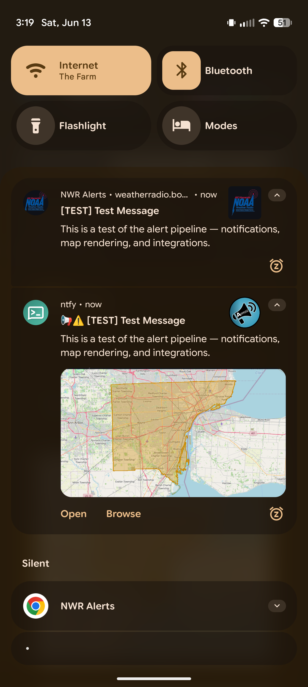
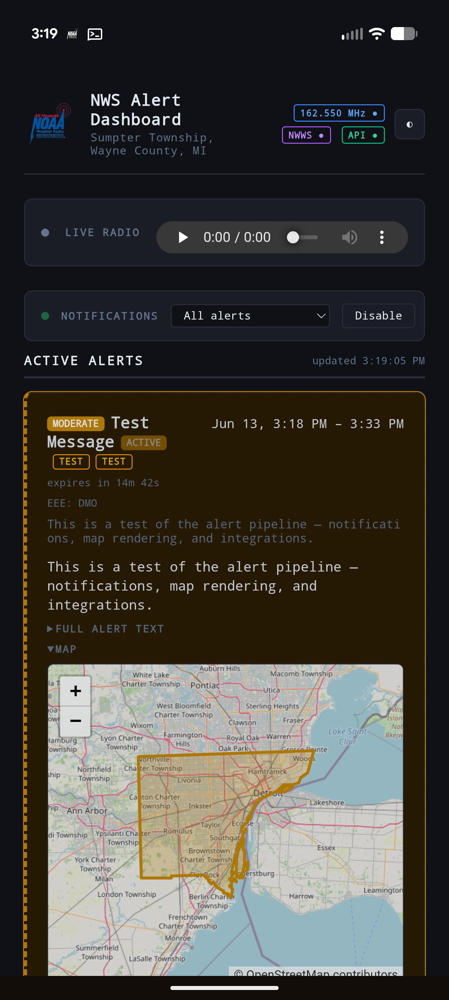

# NWS Alert Dashboard

A self-hosted National Weather Service alert monitor with **three independent alert sources**, cross-source deduplication, polygon maps, and flexible notifications, all in one Docker container.

| Source | Transport | Latency | Works offline? | Needs |
|---|---|---|---|---|
| **NWWS-OI** | XMPP push from the NWS Weather Wire Service | seconds | no | [free NWS credentials](https://www.weather.gov/nwws/) |
| **NOAA Weather Radio** | RTL-SDR receiving NWR broadcasts (SAME/EAS decode) | seconds | **yes** | ~$30 RTL-SDR dongle |
| **NOAA REST API** | api.weather.gov polling | ≤ poll interval | no | nothing |

The same warning usually arrives on all three. The **ingest core** dedups them (VTEC event tracking plus SAME county/time heuristics), notifies **exactly once** via whichever source delivered first, and folds the richer details (headline, full text, storm polygon) into one alert record as they land. This multi-sourcing can lead to getting an alert seconds or minutes faster.

**If your internet goes down, the radio path keeps working.** Alerts are decoded off the air, the broadcast audio is recorded, and the map falls back to locally cached county boundaries. Nothing in the warning path depends on the cloud.

One thing to plan for in that offline case: push and web-push notifications still travel over your network, so a phone or tablet only receives them while it is on the same LAN as the container. Many phones automatically drop a Wi-Fi network once they detect it has no internet access, which quietly stops those notifications from arriving. If you are counting on the radio path during an outage, keep a device pinned to the local network (or just watch the dashboard directly), and treat a battery-backed weather radio as the real backstop.

> [!WARNING]
> **Unofficial project. Not affiliated with, endorsed by, or supported by NOAA or the National Weather Service.**
> Treat it as a *supplementary* monitor, **never your only source of life-safety warnings.** Software, hardware, radio reception, and network links can and do fail, delay, drop, or misreport alerts. Always keep an official channel: a battery-backed NWR/SAME weather radio, Wireless Emergency Alerts (WEA) on your phone, outdoor sirens, and local media. Provided **with no warranty**. See [Disclaimer](#disclaimer) and [LICENSE](LICENSE).

## Screenshots

| Dark theme | Light theme |
|---|---|
|  |  |

| Mobile push notification | Installed PWA |
|---|---|
|  |  |

## Features

- **Web dashboard** (PWA): live-updating (SSE) active and historical alerts with source badges (RADIO / NWWS / API), full alert text, broadcast recordings, a live radio stream, searchable history, and interactive Leaflet maps served from a **local tile cache**. Light and dark themes, plus per-source health chips (tuned frequency, NWWS, API) that show at a glance when a source is down.
- **Animated radar**: per-alert maps overlay time-correct NEXRAD radar for precip/convective events — looping across the event while it's active and replaying its timeframe afterward — with a pin marking your location. Online enrichment only; the offline notification maps are untouched.
- **Alert updates**: in-place NWS revisions (reworded text, a tightened polygon, raised severity) update the alert and are flagged with an **UPDATED** badge and a collapsed revision history; optional re-notification on escalation (`RENOTIFY_ON_UPDATE`).
- **Broad event coverage**: all SAME/EAS codes plus common non-EAS advisories (excessive heat, extreme cold, red flag, dense fog, wind, and so on) that only arrive via the API or NWWS sources. See the full [event reference](EVENTS.md); tune the set in `FILTER_EVENT_CODES`.
- **Alert maps**: a per-alert PNG rendered offline (Pillow over cached OSM tiles) and attached to notifications, with the storm polygon when available and county boundaries otherwise.
- **Notifications** via [Apprise](https://github.com/caronc/apprise): ntfy (with per-event priority and topic routing), Discord, Telegram, Pushover, email, and roughly 80 other services, plus browser web-push with per-device event filters.
- **MQTT publishing** for Home Assistant automations.
- **Location auto-setup**: set `LOCATION=lat,lon` and the county SAME code, UGC zones, and a radio frequency scan list are derived for you.
- Frequency rotation with silence detection and primary failback, a rolling audio recorder, an Uptime Kuma heartbeat, and retention policies.

## Quick start (no SDR needed)

```bash
git clone https://github.com/robwolff3/NWS-Alert-Dashboard.git
cd NWS-Alert-Dashboard
cp .env.example .env
# edit .env: set LOCATION=lat,lon, API_USER_AGENT contact, and a
# notification target (NTFY_* or NOTIFY_URLS); set RADIO_ENABLED=false
docker compose up -d --build
```

Open `http://host:8082`. To verify notifications and map rendering end to end, uncheck **Hide test alerts** in the Alert History header to reveal the **Send test alert** button, then click it.

## Adding the radio source

1. Plug in an RTL-SDR dongle (RTL2832U). Find it: `lsusb | grep -i RTL`
2. `cp compose.override.example.yaml compose.override.yaml` and set the device path; set `RTL_DEVICE` in `.env`
3. Set `RADIO_ENABLED=true`. Leave `RADIO_FREQUENCY` blank to scan all seven NWR channels until one decodes, or set your transmitter's frequency ([transmitter search](https://www.weather.gov/nwr/station_search))
4. `docker compose up -d --build --force-recreate`

Reception notes: keep `RADIO_SQUELCH=0` (squelch can swallow SAME bursts), use `rtl_test -p` for the PPM correction, and expect the weekly RWT test (Wednesdays) as your end-to-end confirmation.

The image pins `rtl-sdr 0.6.0-3` on purpose. The newer RTL-SDR Blog fork silently ignores `-E deemp`, which breaks FM de-emphasis on NWR.

## Adding NWWS-OI

1. [Apply for credentials](https://www.weather.gov/nwws/) (free; can take 30+ days)
2. Set `NWWS_ENABLED=true`, `NWWS_USER`, `NWWS_PASS`

The client connects to either NWWS server (College Park or Boulder), alternates hosts on reconnect, and keeps the session alive with XMPP pings. While NWWS is connected the REST poller relaxes to `API_POLL_SECS`; when it drops, polling tightens to `API_POLL_SECS_DEGRADED` automatically.

## Home Assistant (MQTT)

Set `MQTT_ENABLED=true` and broker details. Each notified or updated alert publishes JSON to `nws-alerts/alert`, and a **retained** summary of active alerts to `nws-alerts/active`.

```yaml
automation:
  - trigger:
      platform: mqtt
      topic: nws-alerts/alert
    condition: "{{ trigger.payload_json.priority >= 4 and not trigger.payload_json.is_test }}"
    action:
      service: notify.everyone
      data:
        title: "{{ trigger.payload_json.event_name }}"
        message: "{{ trigger.payload_json.headline }}"
```

## ntfy on Android

The notification routing earns its keep with the [ntfy](https://ntfy.sh/) Android app. The dashboard tags every alert with a priority based on its event code (see the `NOTIFY_PRIORITY_*_CODES` lists in `.env.example`), and ntfy maps that priority onto Android's notification channels. The practical payoff is that alerts can behave very differently depending on how serious they are:

- **Top-priority events** (tornado warning, flash flood emergency) can pop up, vibrate, and sound an alarm. In the ntfy app you can set that subscription's channel to **override Do Not Disturb**, so a 3 a.m. tornado warning still wakes you even with the phone silenced.
- **Mid-priority events** ring or buzz the way a normal notification does.
- **Low-priority advisories** (heat, fog, frost) can come in as **silent notifications** that land in the shade without a sound, so routine statements do not nag you.

If you want even finer control, route severities onto separate topics with `NTFY_PRIORITY_*_TOPIC`. Each topic is its own subscription in the app, so you can give each one its own sound, vibration, and DnD-override setting.

## Configuration

Everything is set with environment variables in `.env` (copy it from [`.env.example`](.env.example), which documents every option inline). The settings you are most likely to change:

| Variable | Default | What it does |
|---|---|---|
| `LOCATION` | — | Your `lat,lon`. Auto-derives the county SAME code, UGC zones, and the radio scan list for anything left blank below. |
| `RADIO_ENABLED` | `true` | Enable the NOAA Weather Radio (RTL-SDR) source. |
| `NWWS_ENABLED` | `false` | Enable the NWWS-OI push source (needs `NWWS_USER` / `NWWS_PASS`). |
| `API_ENABLED` | `true` | Enable the api.weather.gov polling source. |
| `API_USER_AGENT` | — | Contact string required by api.weather.gov; put your email here. |
| `FILTER_SAME_CODES` | from `LOCATION` | County SAME codes to watch (space-separated `PSSCCC`). |
| `FILTER_ZONES` | from `LOCATION` | UGC forecast zones for zone-based products (winter storms, etc.). |
| `FILTER_EVENT_CODES` | all | Event codes allowed to notify; others are stored but stay silent. |
| `RTL_DEVICE` | — | RTL-SDR USB device path (radio only; also set in `compose.override.yaml`). |
| `RADIO_FREQUENCY` | scan | NWR frequency in MHz; blank scans all seven channels. |
| `NTFY_URL` / `NTFY_USER` / `NTFY_PASS` | — | ntfy server shortcut with per-priority topic routing. |
| `NOTIFY_URLS` | — | Space-separated Apprise URLs (Discord, Telegram, email, …). |
| `NOTIFY_PRIORITY_{5,4,3}_CODES` | see example | Event codes mapped to each notification priority level. |
| `MQTT_ENABLED` | `false` | Publish alert JSON to MQTT for Home Assistant. |
| `MAP_ENABLED` | `true` | Cache tiles/boundaries and render per-alert maps offline. |
| `RADAR_ENABLED` | `true` | Animated NEXRAD radar overlay on dashboard maps for precip/convective alerts. |
| `RENOTIFY_ON_UPDATE` | `escalation` | Re-notify on in-place revisions: `off`, `escalation` (severity rise / PDS wording), or `all`. |
| `WEB_PUSH_ENABLED` | `true` | Show the browser web-push controls in the dashboard. |
| `SITE_TITLE` / `SITE_SUBTITLE` | auto | Dashboard heading; the subtitle auto-fills from `LOCATION` when blank. |

See [`.env.example`](.env.example) for the complete, commented list — radio tuning, poll intervals, dedup window, map zoom/buffer, retention, and more.

### Choosing which events notify

`FILTER_EVENT_CODES` is an **opt-in allowlist**. Leave it blank (the default) and every event notifies; set it and only the listed event codes notify — anything else is still ingested and shown on the dashboard but stays silent. You rarely need to prune it by geography: api.weather.gov only returns alerts for the zones and county derived from your `LOCATION`, so an inland setup never receives marine or tropical alerts even with those codes left in the list. Trim it only to silence event *types* you don't want (e.g. drop the advisory-tier codes to keep just warnings). [`EVENTS.md`](EVENTS.md) lists every event code, its name, and its VTEC mapping, plus the routine informational products that are intentionally left unmapped.

## Architecture

```
RADIO: rtl_fm → recorder.py → multimon-ng → dsame3 ──→ notify.py ─┐
NWWS:  nwws_client.py (slixmpp MUC) → nwws_parse.py ──────────────┼→ ingest.py → SQLite
API:   api_poller.py (alerts/active) ─────────────────────────────┘      │
                            notify-once → Apprise (+map PNG) + web push + MQTT
web.py (Flask: SSE dashboard, Leaflet, /tiles) ←──────────────── SQLite
map_cache.py (one-time: zone GeoJSON + OSM tiles → ./alerts/mapdata)
```

Dedup: alerts carrying VTEC (NWWS, API) match on `office.phen.sig.etn.year`; radio SAME decodes match heuristically on event equivalence (SAME-to-VTEC code mapping) plus county FIPS overlap plus a `DEDUP_WINDOW_SECS` time window. The first source to land an alert claims the notification atomically; later arrivals enrich missing fields (radio never overwrites richer text). When NWS reissues an alert in place — reworded text, a tightened polygon, raised severity — the rich sources overwrite the changed content, keep prior versions as a revision history, and optionally re-notify on escalation (`RENOTIFY_ON_UPDATE`). A radio-first alert triggers an immediate API poll, so the headline and polygon usually merge in within seconds, and a one-time map follow-up notification fires once the polygon arrives.

## Testing

```bash
# Dedup matrix + parser tests (in the running container)
docker exec nwsalertdashboard python3 /app/scripts/tests/test_dedup.py
docker exec nwsalertdashboard python3 /app/scripts/tests/test_nwws_parse.py

# Full radio-path E2E: synthesizes a SAME weekly test and pipes it through
# recorder → multimon-ng → dsame3 → notify (use a test ntfy topic!)
docker exec -e NTFY_TOPIC_DEFAULT=nws-test nwsalertdashboard \
  bash /app/scripts/tests/test_inject.sh

# Replay archived NWS text products through the NWWS ingest path
docker exec nwsalertdashboard python3 /app/scripts/nwws_client.py \
  --replay /app/scripts/tests/fixtures/TORDTX.txt --log-only
```

## Notes

- **ntfy map attachments** require `attachment-cache-dir` in your ntfy server config; without it the dashboard automatically falls back to text-only notifications.
- The OSM tile cache is a small one-time regional fetch (roughly 10 to 15 MB, throttled) consistent with the [OSM tile usage policy](https://operations.osmfoundation.org/policies/tiles/). Point `MAP_TILE_URL` at another provider or a self-hosted tile server if you need more.
- api.weather.gov requires a contact address in `API_USER_AGENT`.

## Disclaimer

This software is an independent, hobbyist project. It is **not** affiliated with, endorsed by, or supported by NOAA, the National Weather Service, or any government agency.

- **Not a primary warning source.** Use it to *supplement* official life-safety channels, never to replace them: NOAA Weather Radio, Wireless Emergency Alerts (WEA), outdoor sirens, TV and radio broadcasts, and the official [weather.gov](https://www.weather.gov/).
- **No guarantee of accuracy, completeness, or timeliness.** Alerts may be missed, delayed, duplicated, mis-prioritized, or rendered incorrectly. Radio reception depends on hardware, antenna, terrain, and transmitter status; the push and poll sources depend on third-party availability.
- **No warranty.** As stated in the [GPLv3 LICENSE](LICENSE), the software is provided "as is", without warranty of any kind.
  You assume all risk for how you deploy it and what you rely on it for.
- **Your responsibility:** comply with the terms of each data source you enable, including the [NWWS-OI](https://www.weather.gov/nwws/) usage guidelines, the [api.weather.gov](https://www.weather.gov/documentation/services-web-api) terms, and the [OpenStreetMap tile usage policy](https://operations.osmfoundation.org/policies/tiles/).

## Acknowledgements

Built on a lot of excellent open-source work:

- **[dsame3](https://github.com/jamieden/dsame3)** handles SAME/EAS message decoding (a Python 3 SAME decoder in the `dsame` lineage); it is cloned and patched at build time.
- **[multimon-ng](https://github.com/EliasOenal/multimon-ng)** does the SAME/AFSK demodulation from the FM audio stream.
- **[rtl-sdr](https://osmocom.org/projects/rtl-sdr/wiki)** (Osmocom) provides the RTL2832U SDR tools, including `rtl_fm`.
- **[slixmpp](https://slixmpp.readthedocs.io/)** is the XMPP client for the NWWS-OI feed.
- **[Apprise](https://github.com/caronc/apprise)** fans notifications out to dozens of services.
- **[Leaflet](https://leafletjs.com/)** renders the interactive web maps.
- **[OpenStreetMap](https://www.openstreetmap.org/copyright)** supplies the base map tiles (© OpenStreetMap contributors, [ODbL](https://opendatacommons.org/licenses/odbl/)).
- The Python stack: **[Pillow](https://python-pillow.org/)**, **[Flask](https://flask.palletsprojects.com/)**, **[waitress](https://github.com/Pylons/waitress)**, **[pywebpush](https://github.com/web-push-libs/pywebpush)**, and **[paho-mqtt](https://github.com/eclipse/paho.mqtt.python)**.

Alert data comes from the **U.S. National Weather Service and NOAA**: [api.weather.gov](https://www.weather.gov/documentation/services-web-api), the [NWWS-OI](https://www.weather.gov/nwws/) feed, and NOAA Weather Radio broadcasts. NWS products are public-domain U.S. government works.

## License

[GPLv3](LICENSE) © 2026 Rob Wolff <rob@borked.io>
